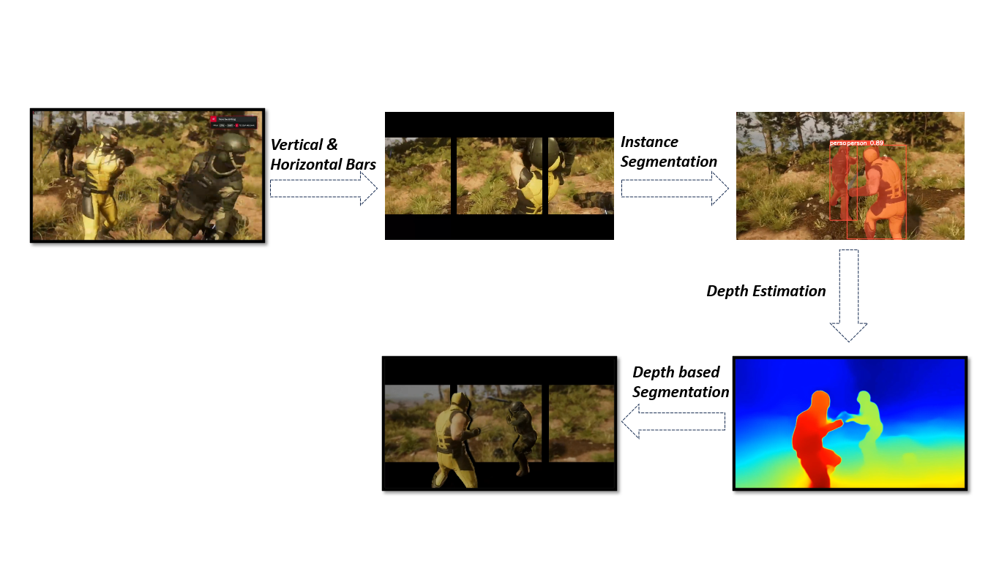

# Get-3D
     
## Overview
Get-3D is a Python-based project for generating glasses-free 3D videos using depth estimation and instance segmentation techniques. It utilizes YOLOv8 for segmentation and MiDaS for depth estimation to apply depth-based effects on objects in a video.

## Features
- **Instance Segmentation**: Uses YOLOv8 for object segmentation.
- **Depth Estimation**: Uses MiDaS model to estimate depth.
- **3D Effect Application**: Applies zoom effects and masking to simulate 3D depth.
- **Real-time Video Processing**: Processes frames sequentially with a progress bar.

## Methodology
The following diagram illustrates the methodology used in Get-3D:



## Requirements
The required dependencies are listed in `requirements.txt`. Install them using:

```sh
pip install -r requirements.txt
```

### requirements.txt
```txt
opencv-python
numpy
torch
ultralytics
torchvision
tqdm
``` 

## Usage

### Running the Script
Ensure the paths to your video files and models are correctly specified in the script. Then, execute the script using:

```sh
python Get-3D/script.py
```

### Input
- A video file (e.g., `wolf.mp4`) that will be processed.
- Pre-trained YOLOv8 model (`yolov8x-seg.pt`) for instance segmentation.

### Output
- A processed 3D video saved to the specified output path.


## Acknowledgments
This project uses YOLOv8 from [Ultralytics](https://github.com/ultralytics) and MiDaS from [Intel-ISL](https://github.com/intel-isl/MiDaS).
Parts of this project page were adopted from the [Nerfies](https://nerfies.github.io/) page.

## Website License
<a rel="license" href="http://creativecommons.org/licenses/by-sa/4.0/"></a><br />This work is licensed under a <a rel="license" href="http://creativecommons.org/licenses/by-sa/4.0/">Creative Commons Attribution-ShareAlike 4.0 International License</a>.
